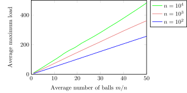
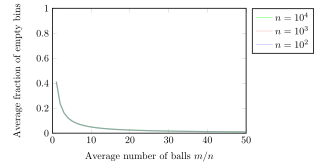

# Code for the  paper "Tight Bounds for Repeated Balls-into-Bins"

This repository contains the relatively simple C++ code for reproducing the experiments for the Repeated Balls-into-Bins (RBB) process in the paper "Tight Bounds for Repeated Balls-into-Bins" which appeared in STACS 2023 ([arxiv version](https://arxiv.org/abs/2203.12400)).

There are two quantities that are being plotted in this paper: (i) the maximum load and (ii) the number of empty bins. These are collected for RBB process starting with the initially uniform load vector for $n \in \{10^2, 10^3, 10^4\}$ and $m \in \{n, 4n, \ldots, 52n \}$, averaged over $10^6$ rounds and $25$ repetitions. Because of the product of these numbers is large, it means that the program may take a few hours to terminate (Feel free to change the parameters in `src/rbb_stacs_2023.cc` to reduce the running time).

The code produces the points for the following two figures:






## Build instructions

The entire code is a single C++ file (using the C++17 standard), so it can be run using 
```
g++ src/rbb_stacs_2023.cc && ./a.out
```
(or any other compiler). 

In the `/src` directory there is also a `CMakeLists.txt` file if you want to use `cmake`.
